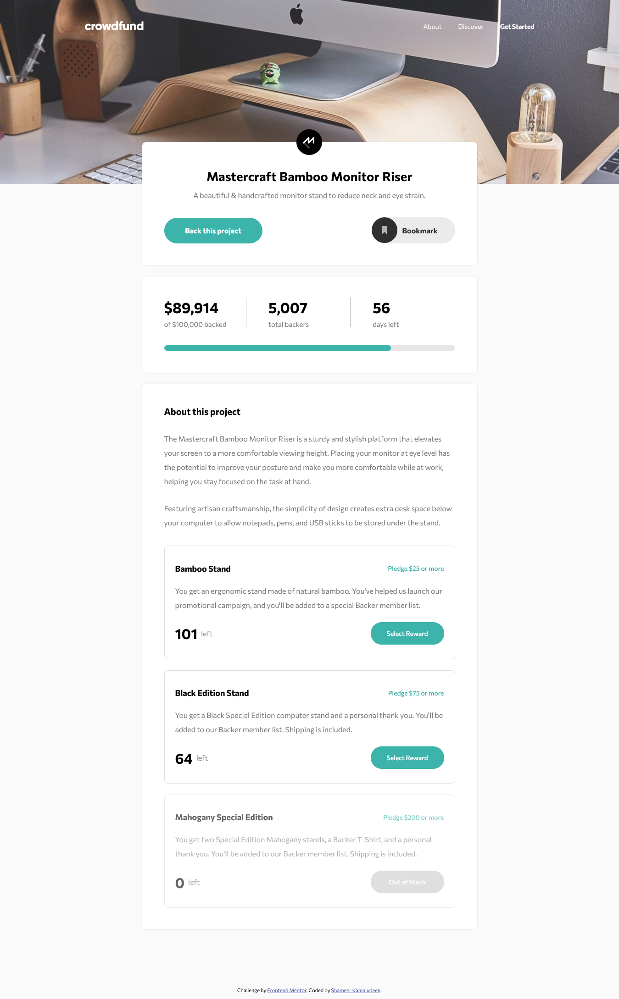

# Frontend Mentor - Crowdfunding product page solution

This is a solution to the [Crowdfunding product page challenge on Frontend Mentor](https://www.frontendmentor.io/challenges/crowdfunding-product-page-7uvcZe7ZR). Frontend Mentor challenges help you improve your coding skills by building realistic projects. 

## Table of contents

- [Overview](#overview)
  - [The challenge](#the-challenge)
  - [Screenshot](#screenshot)
  - [Links](#links)
- [My process](#my-process)
  - [Built with](#built-with)
  - [Useful resources](#useful-resources)
- [Author](#author)

## Overview

The challenge helped to code in JavaScript a lot, Its really a good challenge to learn a lot of JavaScript and helped to improve to place JavaScript code line by line without worry of getting errors. Usage of JavaScript events improved as we may need to use a lot of events. Extensive use of CSS flexbox and grid is also an advantage of this challenge to be thorough our knowledge of them.

### The challenge

Users should be able to:

- View the optimal layout depending on their device's screen size
- See hover states for interactive elements
- Make a selection of which pledge to make
- See an updated progress bar and total money raised based on their pledge total after confirming a pledge
- See the number of total backers increment by one after confirming a pledge
- Toggle whether or not the product is bookmarked

### Screenshot

### Links

- Solution URL: [Click here](https://github.com/shameerkamaludeen/crowdfunding-product-page)
- Live Site URL: [Click here](https://shameerkamaludeen.github.io/crowdfunding-product-page/)

## My process

### Built with

- Semantic HTML5 markup
- Flexbox
- CSS Grid
- Mobile-first workflow
- Constraint Validation API

### Useful resources

- [Flexbox](https://developer.mozilla.org/en-US/docs/Learn/CSS/CSS_layout/Flexbox)
- [Grids](https://developer.mozilla.org/en-US/docs/Learn/CSS/CSS_layout/Grids)
- [Responsive design](https://developer.mozilla.org/en-US/docs/Learn/CSS/CSS_layout/Responsive_Design)
- [Positioning](https://developer.mozilla.org/en-US/docs/Learn/CSS/CSS_layout/Positioning)
- [Constraint validation API](https://developer.mozilla.org/en-US/docs/Web/API/Constraint_validation)
- [Other form controls](https://developer.mozilla.org/en-US/docs/Learn/Forms/Other_form_controls)

## Author

- Github - [Shameer Kamaludeen](https://github.com/shameerkamaludeen)
- Frontend Mentor - [@shameerkamaludeen](https://www.frontendmentor.io/profile/shameerkamaludeen)
